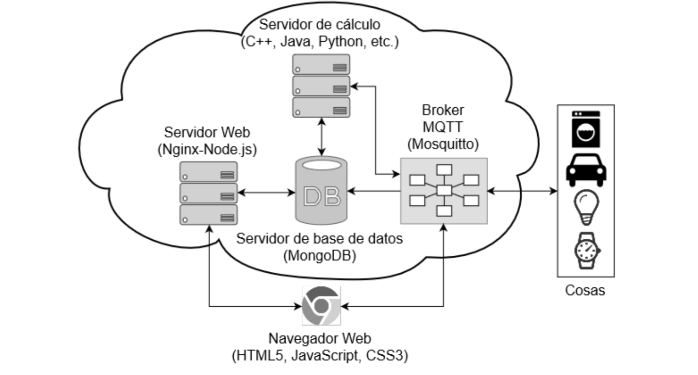
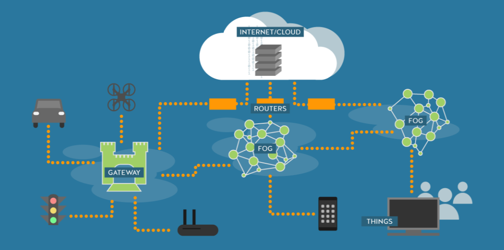
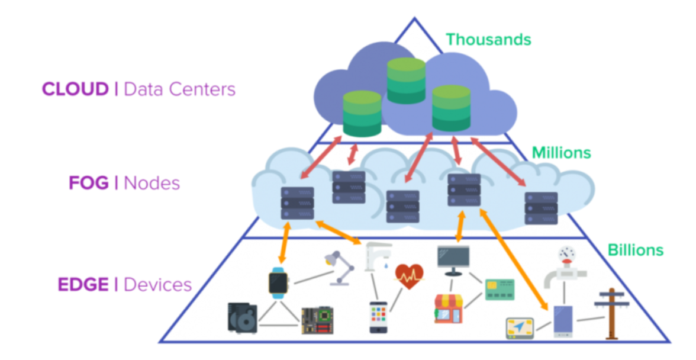
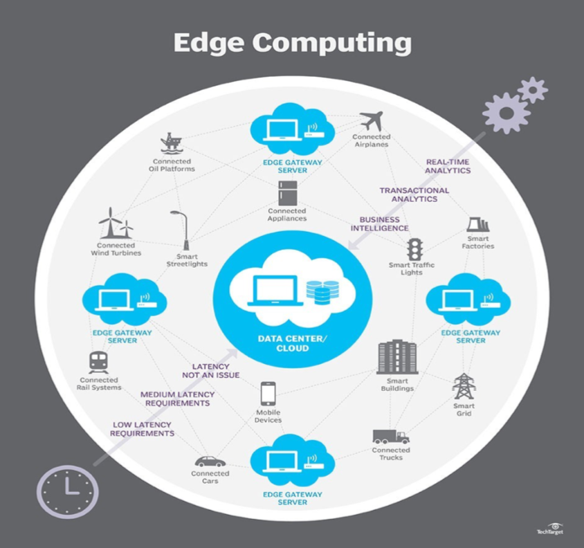

# IOT Y CLOUD COMPUTING

El presente trabajo tiene por objetivo identificar algunos de los aspectos a tener en cuenta en la integración del IoT Y el cloud además del uso del Big Data en estos aspectos, así como las características de esta unión. También hablaremos de nuevas formas de tratar esta problemática.

## INTRODUCCIÓN

Debido a que la cantidad de dispositivos conectados a Internet crece exponencialmente, el volumen de los datos generado por las aplicaciones de usuario en esos dispositivos aumenta cada día. En definitiva se tienen cada vez mas dispositivos conectados a Internet, tales como computadoras, teléfonos móviles, sensores, cámaras de vigilancia, GPS, consolas de videojuegos; cada uno de ellos corriendo aplicaciones tales como redes sociales, georeferenciación, sistemas transaccionales, alertas, etc. y cada una de ellas generando datos en una amplia gama de formatos (texto, gráficos, imágenes, videos, sonidos, etc).

El primer inconveniente que se presenta en estos contextos es el almacenamiento local de los datos, debido a las restricciones físicas que poseen tales escaso almacenamiento, capacidad de procesamiento y memoria, unido a las restricciones de consumo de energía.

Esta problemática plantea la necesidad de la integración del Big Data, el Iot y el Cloud Computing con el fin de definir un nuevo paradigma denominado CoT (Cloud of Things). Esta confluencia tecnológica permitirá que el IoT aporte los medios para que el usuario interactúe mediante redes y dispositivos ubicuos. En este nuevo paradigma, cloud permitirá el acceso a un pool de recursos virtualizados capaces de almacenar y procesar bajo demanda la gran cantidad de datos generada por las aplicaciones alojadas en los dispositivos, esto es el big data.

## CONCEPTOS 

Los avances en computación móvil, redes inalámbricas, dispositivos móviles y sistemas embebidos han dado lugar al paradigma de IoT el cual consiste en una infraestructura de red global y dinámica de nodos (things) interconectados, inteligentes y auto configurables. IoT es un habilitador del ecosistema IoE (Internet of Everything) que permite no solo que las personas se interconecten y se comuniquen, sino que ahora también lo hacen los procesos, los datos y los objetos, convirtiéndose en sus cuatro pilares. Esta interrelación permite transformar la información en acciones que crean nuevas capacidades y experiencias.

La interacción entre los pilares de IoT establece tres tipos de conexiones: personas que se comunican con personas (P2P), máquinas que se comunican con personas (M2P) y máquinas que se comunican con máquinas (M2M). Sin importar cual de estos tipos de conexiones se usan, en todos los casos se trata de una convergencia de múltiples tecnologías para permitir intercambiar datos entre dispositivo conectado. Todo esto se realiza con base en tecnologías de sensores, RFID (Radio Frequency Identification), NFC (Near Field Communications) y sistemas de geolocalización, que permitirán que los objetos cotidianos se conecten y se vuelvan inteligentes, cambiando radicalmente la forma realizan las tareas cotidianas.

Actualmente, el 99% de los objetos que se encuentran en el mundo físico no están conectados aún a Internet sin embargo se estima que para el año 2020 habrá 50 millones de objetos inteligentes conectados a Internet, los cuales proporcionarán billones de gigabytes de datos que deben ser almacenados, procesados y presentados en forma eficiente y fácilmente interpretables. Se considera que el 90% de los datos existentes se han generado en los últimos dos años, esto está dando lugar a la Era del Exa y Zetta Byte [2]. Este aumento en la cantidad de datos demanda nuevas estrategias que permitan su almacenamiento, procesamiento y análisis de manera eficiente; esto conlleva un cambio de paradigma en las arquitecturas de cómputo, los algoritmos y los mecanismos de procesamiento.

Frente a esta problemática se ha popularizado el término Big Data [3], el cual se usa para describir grandes conjuntos de datos, los cuales exhiben las siguientes propiedades: variedad, volumen, velocidad, variabilidad, valor y complejidad; todas ellas denotan a datos multidimensionales. Estas propiedades hacen que los sistemas de cómputo convencionales sean muchas veces inapropiadas para lograr un procesamiento adecuado.

Es aquí donde la integración de la IoT con Cloud Computing permite que esta gran cantidad de datos puedan ser alojados en internet, favoreciendo que recursos, servicios y datos estén disponibles para su uso y para la prestación de servicios end-to-end para empresas y usuarios que accedan desde cualquier lugar, proporcionando la infraestructura virtual de integración para dispositivos de almacenamiento, herramientas de análisis, visualización y plataforma.

En este sentido, Cloud Computing, es un modelo para permitir el acceso en red omnipresente, conveniente y bajo demanda a un conjunto compartido de recursos informáticos configurables tales como, redes, servidores, almacenamiento, aplicaciones y servicios que pueden ser rápidamente aprovisionados y liberados con un mínimo de gestión esfuerzo e interacción con el proveedor o administrador de servicio.

Gracias a estas características una infraestructura cloud permite contar con una cantidad de recursos computacionales virtualmente infinitos, administrados por terceros y accedidos bajo demanda pagando por el uso, de esta manera es posible lograr calidad de servicio (QoS) garantizado por parte del proveedor de la infraestructura cloud.

Cloud es un modelo de prestación de servicios informáticos cuya principal orientación es la escalabilidad. Esto es, que desde el punto de vista de los usuarios, los servicios son elásticos, o sea, pueden crecer o recuperar su tamaño original de manera rápida y sencilla. Esta orientación permite que los usuarios que acceden a los servicios, perciban que todo funciona de manera simple y rápida, dando como resultado una experiencia más gratificante.

En función de esto, cloud se ha convertido en un enorme repositorio de recursos computacionales, lo cual es una buena posibilidad para construir una plataforma para las aplicaciones que necesitan una gran cantidad de recursos. Esta capacidad del cloud se debe principalmente a la habilidad de escalado elástico de recursos en función de las necesidades de las aplicaciones y el presupuesto del usuario. Esta es una tecnología centrada en ofrecer cualquier recurso (bases de datos, red, procesador, etc.) y ofrecerlo como un servicio (AaaS, Anything as a Service) bajo demanda, inclusive el cómputo.

## CARACTERÍSTICAS

IoT promete un mundo donde todo este conectado, para lograr esto es necesario: accesibilidad y conectividad ubicua, orquestación dinámica de dispositivos, óptima utilización de recursos y personalización de servicios. Para lograr que estos servicios sean prestados de manera eficiente y efectiva es necesario asegurar altos niveles de disponibilidad y escalabilidad.

Debido a que los dispositivos de IoT están geográficamente distribuidos sobre plataformas heterogéneas y tienen limitadas capacidades de procesamiento, energía y almacenamiento, aspectos tales como performance, seguridad, confiabilidad e integridad no se pueden asegurar pues no existen recursos necesarios. Esto lleva a la necesidad de integración con el cloud, el cual puede ofrecer sus capacidades ilimitadas (esta es una sensación dada por la virtualización de recursos) de almacenamiento y poder de cómputo.

Por su parte, cloud se puede beneficiar del IoT al poder extender sus límites con las cosas del mundo real, de forma más dinámica y distribuida, y entregar un número masivo de servicios en tiempo real. El cloud actuará como una capa intermedia entre las aplicaciones y los dispositivos, ocultando las funcionalidades y complejidades que poseen.

Una infraestructura que integre cloud e IoT permitirá [9]:
	- Almacenamiento: es posible alojar datos estructurados y no estructurados en múltiples formatos y con las características del big data.
	- Cómputo: uno de los retos en ambientes IoT es la escalabilidad y el cloud lo puede proveer mediante el uso de infraestructura de altas prestaciones capaces de realizar cómputo intensivo.
	- Comunicación: por lo general los dispositivos de IoT usan una IP para identificarse, lo cual no es un esquema global. Para solucionar esto cloud usa la georeferenciación, que permite identificar cualquier objeto en cualquier lugar que este.
	- Nuevas habilidades: IoT se caracteriza por la heterogeneidad de dispositivos, protocolos y tecnologías, esto genera problemas de confiabilidad, interoperabilidad, escalabilidad, seguridad, disponibilidad y eficiencia que el cloud resuelve, además provee facilidad de acceso, facilidad de uso y costos de implementación reducidos.

Estas características serán capaces de proveer procesamiento en tiempo real y aprovisionamiento de recursos dinámico para el big data, mediante la orquestación y administración de instancias virtualizadas de recursos físicos.

## HERRAMIENTAS

En aras de validar la selección de las herramientas antes mencionadas, se ha construido una aplicación web en tiempo real que utiliza dichas herramientas seleccionadas, consiguiendo excelentes resultados. Esta aplicación tiene un enfoque general para IoT, es capaz de persistir la información de telemetría en base de datos, generar reacciones ante eventos predefinidos, ejecutar tareas programadas, presentar información en un dashboard en tiempo real, entre otras características; a partir de las cuales es posible desarrollar futuras aplicaciones de enfoque específico a distintos campos de la ciencia como la Agricultura de Precisión, Ciudades Inteligentes, Domótica, etc. 

### Proveedor Cloud

- AWS IoT Core es la plataforma que permite conectar dispositivos a servicios de AWS y habilitar aplicaciones para que interactúen con los terminales.

- Azure IoT Suite proporciona una colección de servicios destinados al desarrollo de plataformas IoT: monitorización remota de dispositivos ...

- Cloud IoT Core es el servicio que permite conectar y administrar datos desde dispositivos remotos.

Aunque las tres plataformas son de garantías, aún se nota que Google entró más tarde en este mercado y tiene camino por recorrer ya que AWS y Azure presentan mayor madurez de arquitectura y un catálogo más amplio de servicios IoT. Sin duda AWS y Azure son dos buenas alternativas para abordar proyectos IoT. Según los requisitos de los clientes, se suele elegir Azure por su capacidad de integración con nubes privadas, su rendimiento y su amplio catálogo de servicios y aplicaciones IoT.

### Servidor Web (Apache, Nginx y Lighttpd

Apache es el servidor web más utilizado a nivel mundial, es estable y robusto; su manejo de peticiones se da por medio de hilos y procesos, donde cada petición es separada en un hilo de procesamiento diferente utilizando sockets síncronos. En cuanto a su rendimiento, Apache ofrece un servicio bastante eficiente, pero para aplicaciones que requieren de un tráfico considerablemente alto quizás no sea la mejor opción, esto debido a su naturaleza síncrona.

Nginx es un servidor web y proxy inverso (mecanismo desplegado en una red para proteger a los servidores HTTP de una intranet, realiza funciones de seguridad que protegen a los servidores internos de ataques de usuarios en internet). Gestiona las peticiones por medio de una arquitectura orientada a eventos donde las peticiones son aceptadas mediante sockets asíncronos y son procesadas en un único hilo de ejecución, esto a fin de reducir memoria y uso de CPU. La comunidad de Nginx no es tan amplia en comparación a la de Apache debido a su corto tiempo de vida en el mercado. Los tiempos de respuesta son menores con Nginx, Apache se torna cada vez más lento cuando las peticiones aumentan y además tiende a usar más ancho de banda para servir las mismas peticiones.

Lighttpd es un servidor HTTP sencillo pero potente (Lighttpd, 2015), cuya arquitectura es orientada a eventos. Al igual que Nginx, funciona en un solo hilo de procesamiento. Está diseñado y optimizado para ambientes de alto rendimiento con un consumo de memoria bastante reducido respecto a otros servidores web. Su comunidad y documentación no es tan grande, es menor que la de Nginx, pero esto no ha sido impedimento para que sea utilizado por grandes compañías tales como YouTube (para su servidor de descargas), Wikipedia (para su servidor de subida de imágenes), además de otros sitios con tráfico considerable.

---
En el caso del software para servidor web, a pesar que Apache es el más popular hoy en día, se puede apreciar que no es el más indicado para su implementación en IoT debido a su arquitectura de naturaleza bloqueante. Por su parte, Nginx y Lighttpd representan opciones muy viables, sin embargo, Nginx actúa también como un proxy inverso, lo cual añade una capa extra de seguridad entre el cliente y el servidor web, necesarios en entornos IoT como en cualquier aplicación en general.

### Protocolo de comunicación

El popular protocolo HTTP, no es la opción más viable para un entorno IoT ya que requiere de muchos recursos y ancho de banda. Se debe tener en cuenta que los dispositivos que usen este protocolo, tendrán limitaciones en la duración de sus baterías, memoria, ancho de banda, entre otros. Por tanto la selección adecuada del protocolo de comunicación incidirá tanto en el rendimiento individual de cada dispositivo, y en todo el sistema IoT.

El protocolo MQTT está diseñado específicamente para redes de dispositivos Máquina-A- Máquina (M2M) y aplicaciones móviles con restricciones de memoria, batería, red, entre otras. Sus mensajes se transmiten en formato binario y trabaja con el modelo publicador/suscriptor (HiveMQ, 2015), el cual funciona como una vía de comunicación de uno-a-varios clientes, lo cual es útil en IoT para el monitoreo de dispositivos remotos. Esto no impide establecer una conexión uno-a-uno (útil en caso de control de dispositivos en IoT) o de varios-a-uno. MQTT provee tres niveles de calidad del servicio (QoS) para la entrega de mensajes; nivel 0 (Máximo una vez entregado), nivel 1 (Al menos una vez entregado) y nivel 2 (Exactamente una vez entregado). Los clientes MQTT se comunican mediante tópicos, los cuales funcionan como un canal de comunicación privado. Existe incluso una variante de MQTT destinada a redes de sensores con recursos muy restringidos, la cual es definida en (Stanford-Clark & Truong, 2015). Existen varios brokers que implementan el protocolo MQTT, siendo el más famoso de ellos el bróker open source Mosquitto.

El Protocolo de Mensajería de Aplicaciones Web (WAMP, 2015) provee dos modos de comunicación: llamadas de procedimientos remotos (RPC) y publicador/subscriptor (PUB/SUB). Aunque su medio de transmisión es por defecto WebSockets, es posible utilizar medios diferentes (WAMP Protocol, 2015), donde los datos son transmitidos en texto plano o en binario. Las llamadas de procedimientos remotos son útiles para comunicaciones de uno a uno. Por otro lado, el modo publicador/suscriptor es utilizado en comunicaciones de uno a varios o de varios a uno. La comunicación entre clientes se establece mediante tópicos representados mediante URIs. WAMP es capaz de comunicarse de forma nativa con un navegador web sin necesidad de intermediarios. Por ende, resulta sencillo servir datos en tiempo real directamente en la interfaz de un usuario conectado desde algún navegador.

El Protocolo de Aplicación Restringida (CoAP) es utilizado también en dispositivos y redes cuyos recursos son limitados. Funciona bajo UDP con el modelo REST, y además utiliza el modo publicador/suscritor. Difiere de HTTP ya que CoAP no conlleva un alto consumo de recursos y descarta las cabeceras adicionales no necesarias en el entorno IoT. A pesar de sus similitudes con HTTP, CoAP no puede comunicarse nativamente con un navegador web, por lo cual se debe utilizar un gateway como intermediario que traduzca CoAP a HTTP. CoAP ofrece un manejo de calidad del servicio mediante el mecanismo de retransmisión Stop-and-Wait (Técnica utilizada para proveer transferencia confiable de paquetes bajo un sistema de transferencia poco confiable.), sin embargo, no posee un mecanismo de seguridad integrado, aunque puede ser provista por el protocolo de Seguridad de Capa de Transporte de Datagramas (DTLS). Uno de los mayores inconvenientes de DTLS para CoAP, es que no soporta el multicast (Karagiannis et al., 2015), lo cual impone una limitación, ya que ésta es una de las características más importantes de CoAP.

--- 
De los protocolos de comunicación analizados, WAMP posee métodos de comunicación bastante adaptables a IoT, como RPC y Pub/Sub, pero su único inconveniente es no adaptarse bien a entornos con capacidades restringidas, específicamente en el caso del consumo de batería de los dispositivos remotos.
Por otra parte CoAP, está diseñado para este tipo de implementaciones con restricciones, pero puede perder estas características al añadir una capa de seguridad DTLS al protocolo. Si bien DTLS resuelve el problema de seguridad, aumenta también el consumo de recursos de los dispositivos del dominio de sensores.
MQTT es la mejor alternativa por ser un protocolo concebido para ambientes con recursos restringidos, diseñado exclusivamente para sistemas de telemetría con un sistema de seguridad integrado y además cuenta con MQTT-SN, una versión optimizada del protocolo para para redes de sensores, que minimiza al máximo el overhead.

### Framework para aplicación web

El término framework se refiere a un conjunto de herramientas prediseñadas para un lenguaje de programación específico, en este caso para construir aplicaciones web. Los frameworks en tiempo real ofrecen mejores alternativas que los de arquitectura bloqueante en cuanto al manejo de grandes cantidades de peticiones concurrentes, ya que en lugar de dejar un proceso bloqueado mientras espera su finalización, la aplicación puede comenzar el proceso y darle una llamada de retorno (callback) que notificará a la aplicación cuando aquel proceso se complete; deja el bucle de entrada-salida disponible para servir a otros clientes. Por tales motivos, debido a que IoT supone una gran cantidad de dispositivos conectados al mismo tiempo, se ha optado por analizar solo a los frameworks en tiempo real.

Node.js es un framework que utiliza un modelo no bloqueante, orientado a eventos, que lo hace ligero y eficiente (About Node.js, 2015). Una de sus cualidades es su capacidad nativa de trabajar con websockets. Node.js es la plataforma web más popular para aplicaciones en tiempo real y por ende es una excelente alternativa para IoT, además cuenta con una gran comunidad que desarrolla cada vez más librerías que se incorporan con facilidad en cualquier proyecto. Actualmente ya se disponen incluso de librerías IoT para open hardware como: Arduino, Raspberry, Beaglebone, entre otros. Node funciona con JavaScript y ha evolucionado hasta ser utilizado en dispositivos embebidos, pudiendo llegar a convertirse en un lenguaje de programación para aplicaciones de servidor, cliente (navegador web) y dispositivos embebidos.

Tornado es un framework potente y escalable escrito en Python. Es lo suficientemente robusto como para manejar un tráfico web intensivo (Dory et al., 2012), es fácil de configurar y puede ser utilizado para una gran variedad de aplicaciones. Tornado es capaz de manejar decenas de miles de conexiones concurrentes y está diseñado específicamente para ser un framework de alto rendimiento. También posee varias herramientas para seguridad y autenticación de usuarios. Para reducir al mínimo el costo de conexiones concurrentes utiliza un bucle de eventos de un solo subproceso. Esto significa que todo el código de aplicación debe ser asíncrono y sin bloqueo, porque sólo una operación puede estar activa a la vez.

Play es un framework web no bloqueante orientado a eventos, funciona con Java o Scala, dos lenguajes de programación caracterizados por su alto rendimiento. Al igual que Node y Tornado, está construido para soportar un gran número de conexiones concurrentes sin que su rendimiento se vea afectado. Play tiene un gran soporte para las bases de datos no relacionales y para websockets. Su gestor de paquetes (Maven) es el segundo más grande después de npm de Node. A diferencia de Node y Tornado, Play es un framework full-stack, es decir, viene con todas las herramientas para la creación de aplicaciones web ya incorporadas para que los desarrolladores se concentren en la lógica de negocio y no tanto en la infraestructura de su aplicación (Petrella, 2013).

---
En cuanto a los frameworks para el desarrollo de la aplicación web; las tres opciones han demostrado ser candidatos muy eficientes para IoT, pero Node.js es la elección más conveniente debido a su amplia gama de paquetes disponibles que pueden ser implementados para IoT. Además ya existen varias aplicaciones funcionales en Node.js como The Thing System (The Thing System, 2015), Node-RED (Node-RED, 2015), e incluso un microcontrolador llamado Tessel (Tessel, 2015) que funciona en su totalidad con Node.

### Base de datos

Para almacenar y procesar grandes cantidades de información, las alternativas de bases de datos relacionales podrían no satisfacer todas las necesidades requeridas (McCreary et al., 2014). Es ahí donde las bases de datos NoSQL entran en acción debido a la flexibilidad que proporcionan al momento de almacenar y gestionar los datos, siendo esto muy importante en el ámbito de IoT.

MongoDB es una base de datos de propósito general. La facilidad que proporciona al momento de realizar consultas a la misma es una de sus cualidades, ya que posee un conjunto de funciones con algoritmos lo suficientemente aptos para devolver los datos solicitados en consultas no tan complejas. A pesar de ser un almacén de documentos también permite realizar consultas complejas, distinguiéndose de otras bases de datos y convirtiéndose en una opción muy potente. Proporciona además, una lista cada vez mayor de características importantes (Chodorow et al., 2013) como indexación secundaria, única, compuesta, geoespacial y de texto completo.

El teorema CAP (Consistencia-Disponibilidad-Tolerancia de particionado) (Gilberth et al., 2012) define que una base de datos sólo puede cumplir como máximo dos de sus apartados al mismo tiempo. Consistencia se refiere a que todos los clientes de la base de datos son capaces de ver los mismos datos, incluso con actualizaciones concurrentes. La disponibilidad asegura que todos los clientes sean capaces de acceder a versiones posiblemente distintas de los datos, pero siempre los tendrán a su disposición. Tolerancia de particionado se refiere a la facilidad de la base de datos para desplegarse en distintos servidores. En tal sentido, MongoDB asegura consistencia de sus datos y tolerancia de particionado (MongoDB, 2010), importante para IoT, especialmente la consistencia ya que sería un problema si un cliente visualizara en su dashboard (Interfaz de usuario con gráficas representativas de datos históricos y/o en tiempo real.) que un actuador esté apagado, mientras que otro que recibió una versión de ese dato anterior, visualiza que el mismo actuador aún está encendido. MongoDB ha sido utilizada por grandes y reconocidas empresas a nivel mundial e incluso se ha comprobado su eficiencia en entornos IoT en (MongoDB IoT, 2015).

CouchDB es una base de datos cuya arquitectura interna es bastante tolerante a fallos, es decir, cuando se produce algún error, éste se aísla en un entorno controlado y se le da tratamiento. Las consultas se basan en vistas map-reduce escritas en código JavaScript. Dentro del teorema CAP se garantiza disponibilidad y tolerancia de particionado (Anderson et al., 2015) y presupone un problema al priorizar la disponibilidad ya que distintos clientes podrían visualizar información diferente de un mismo dato, unos podrían obtener una versión actual, mientras que otros obtendrían una versión anterior, lo cual no sería conveniente.

Couchbase es una base de datos distribuida, originalmente basada en CouchDB y Membase, aprovecha un sistema integrado de capa de almacenamiento en caché de RAM, soporta operaciones muy rápidas, tales como crear, almacenar, actualizar y obtener datos. Dentro del teorema CAP, Couchbase se comporta diferente según su implementación (Biyikoglu, 2014), por ejemplo, si consta de un único clúster, entonces garantizaría consistencia de los datos y tolerancia de particionado, mientras que en un multi-clúster se garantizaría disponibilidad de los datos y tolerancia de particionado.

--- 
De las distintas bases de datos analizadas, CouchDB presentó inconvenientes debido a su diseño, el cual dificulta el filtrado de datos por más de un campo, y además, garantiza disponibilidad de los datos antes que consistencia, un comportamiento no deseado en IoT. Couchbase en cambio, puede ser una opción muy buena si se implementa como un único clúster, caso contrario garantizaría disponibilidad antes que consistencia de los datos. MongoDB es la elección más adecuada, puesto que asegura consistencia de los datos sin importar el modo de implementación de la base de datos, siendo esta una gran ventaja sobre las demás en cuanto a IoT se refiere.

Si el almacenamiento de la cloud está diseñado para cantidades inmensas de información (lo cual es el caso de BigData), resulta conveniente utilizar soluciones de procesamiento y almacenamiento distribuido como Hadoop (Karanth, 2014), a fin de asegurar la escalabilidad de la infraestructura. Hadoop posee un sistema de archivos (HDFS) en el cual una vez que ha sido almacenada su información, ésta es inmutable; es decir, no puede ser modificada. Esto no representa inconvenientes en un sistema de telemetría como IoT ya que la información capturada desde los sensores o actuadores es fija. Cabe destacar que Hadoop y MongoDB son bastante compatibles y pueden ser utilizados de forma conjunta (Sitto & Presser, 2015).

#### CONCLUSIÓN HERRAMIENTAS

Como resultado de este análisis, se resume las herramientas seleccionadas para el ámbito IoT a nivel de Cloud Computing, estas son: Nginx, Node.js, MongoDB y MQTT

## Fog Computing

Fog computing se considera como una extensión del paradigma de computación en nube desde el núcleo de la red hasta el borde de la red[9]. Esta plataforma proporciona servicios de computación, almacenamiento y trabajo en red entre dispositivos finales y servidores en la nube tradicionales[9]. Por lo general tiene tareas que pueden ser para admitir funciones de red básicas o nuevos servicios y aplicaciones que se ejecutan en un entorno de espacio aislado.

### ¿Cómo funciona?

Cada día va creciendo la producción de datos gracias a los dispositivos y sensores, pero estos no tienen los recursos de cómputo y almacenamiento para realizar análisis avanzados y tareas de aprendizaje automático. En algunos casos los servidores en la nube tienen la capacidad de hacerlo, pero no son lo suficientemente adecuados para procesar los datos y lo más importante, hacerlo de manera oportuna.
En Fog computing, el procesamiento tiene lugar en un centro de datos en un dispositivo in- teligente, o en un enrutador o puerta de enlace inteligente, lo que reduce la cantidad de datos enviados a la nube[9]. Pero estas redes complementan mas no reemplazan, la computación en la nube; el empan ̃amiento permite la analítica a corto plazo, y la nube realiza análisis a largo plazo que requieren muchos recursos.

### Características

1) Calidad de servicio: Es una métrica importante para el servicio de niebla y se puede dividir en cuatro aspectos: conectividad, confiabilidad, capacidad y retardo.

2) Modelo de interfaz y programación.: Se necesita una interfaz unificada y un modelo de programación, todo para facilitar el esfuerzo de los desarrolladores para trasladar sus aplicaciones a la plataforma de cómputo de niebla(Fog computing). La computación centrada en la aplicación será un importante modelo de computación de niebla, en el que los componentes del entorno serán conscientes de la aplicación y permitirán optimizaciones adecuadas para diferentes tipos de aplicaciones.

3) Descarga de computación: La descarga de computación puede superar las restricciones de recursos en dispositivos móviles, ya que algunas tareas que requieren un uso intensivo de computación pueden beneficiarse de la descarga en el rendimiento de las aplicaciones, ahorrando el almacenamiento y la vida útil de la batería. El trabajo existente de descarga de computación para la computación en nube móvil se puede clasificar en seis indicadores: objetivos, granu- laridad, esquema, adaptación, ejecución distribuida y comunicación. Se propone el método de descarga de código y descarga de perfil para tomar decisiones sobre futuras invocaciones que se adapten al cambio de conectividad de red, ancho de banda y latencia.

4) Contabilidad, facturación y seguimiento.: Fog computing no puede ser próspero sin un modelo de negocio sostenible. Los usuarios finales, que desean intercambiar sus equipos de cómputo de repuesto, almacenan su nube privada local para reducir el costo de propiedad. Por lo tanto, para poder realizar ”Pago por uso”, debemos resolver muchos problemas. Por ejemplo, en términos de facturación, se necesita averiguar cómo establecer el precio para diferentes recursos y cómo establecer la fracción del pago que se destina a diferentes partes de fog computing. Para hacer cumplir esas políticas de precios, necesitamos contabilidad y monitoreo.

5) Aprovisionamiento y gestión de recursos.: Aprovisionamiento consciente de la aplicación, es uno de los desafíos se encuentran en la movilidad del nodo final, ya que las métricas como el ancho de banda, el almacenamiento, el cálculo y la latencia se cambiarán dinámicamente. Con el fin de cumplir con el requisito de calidad de servicio, como el retardo, debemos realizar el aprovisionamiento a fin de preparar los recursos para proporcionar la movilidad del servicio. Al planear la migración del operador hacia adelante, garantiza restricciones de latencia de extremo a extremo y reduce la utilización de la red.

6) Seguridad y privacidad: Se caracteriza por usar diferentes métodos para garantizar la seguridad de sus usuarios, tales como seguridad biométrica, uso de codigos adicionales, entre otros. Todo esto con el fin de proteger todos los datos que cada día se suben a la nube, y garantizar la seguridad para sus usuarios.

## Edge Computing

Con los inicios del concepto “La nube” en informática causó un gran avance, pues esto abrió la puerta a innumerables dispositivos que sin tener altas capacidades de computo podían trabajar con buen rendimiento permitiendo la conexión de las máquinas al internet el cual es cada vez es más amplio. Sin embargo, en muchos casos los tiempos de respuesta o la velocidad que requieren algunas operaciones es mayor que lo que la nube puede ofrecer. Los procesos más complejos y de gran taman ̃o necesitan un poder computacional cada vez más rápido y efectivo, sin poder esperar para conectarse a alguna redy teniendo esta situación es ahí donde tenemos a Edge Computing[10].

Edge Computing hace referencia a cómo los procesos computacionales se realizan al interior de los dispositivos edge: aparatos IoT con capacidad de análisis y procesamiento como routers o gateways de red, la “periferia” (edge) de la red[1]. Al procesar la información obtenida cerca de donde fue creada, sin tener que enviarla a centros de datos lejanos se reducen latencias, se consume un menor ancho de banda y se puede hacer análisis y evaluación inmediata de la información generada por los sensores y dispositivos[10].

### ¿Cómo funciona?

Edge Computing es una red de malla de micro centros de datos que procesa o almacena datos críticos localmente y empuja todos los datos recibidos a un centro de datos central o repositorio de almacenamiento en la nube, en una superficie de menos de 30 metros cuadrados[11]. Así, se trata de un concepto estrechamente relacionado con la idea de Internet de las cosas. Al alejarse de los centros de datos centrales, los centros de datos periféricos, se reduce la latencia y mejora el rendimiento general, mejorando notablemente la entrega de servicios digitales[12]. Mediante la optimización y el futuro de los centros de datos de borde, las aplicaciones pueden reducir los fallos del servidor[1].

### Características

1) Velocidad: Edge computing hace decrecer en gran manera la latencia ya que los datos no tienen que viajar sobre la red hasta un centro de datos remoto o mediante la nube para ser procesados.
2) Seguridad: Como los datos permanecen cercanos a la dirección donde fueron creados entonces se mejora la seguridad de dicha información.
3) Escalabilidad: Edge computing es fundamentalmente cómputo distribuido, lo que significa mejorar la resiliencia, reducir las cargas de red y que es más fácil de escalar.
4) Costos bajos: Los costos de transmisión de datos son mejores porque es reducida la cantidad de datos transferidos hacia una ubicación central para almacenarlos.

## CONCLUSIÓN

La Edge Computing se refiere de forma específica a cómo los procesos computacionales se realizan en los los dispositivos IoT con capacidad de análisis y procesos como routers o gateways de red mientras que Fog Computing se refiere a las conexiones de red entre los dispositivos edge y la nube. Hace tiempo que el OpenFog Consortium formado por Cisco, Intel, Microsoft, Dell EMD y algunas instituciones académicas trabaja en especificaciones para ese tipo de implantaciones en las que los sistemas Edge Computing, los Fog Computing y los Cloud Computing interactúan para tener un sistema aún más óptimo en cuanto a la problemática planteada[9].

---

Gracias a los beneficios de estos dos paradigmas se puede expandir y mejorar el uso de la computación en la nube, derivando en el desarrollo de mejores sistemas de información para diferentes campos que se benefician de la tecnología como la salud, el medio ambiente, el transporte, la seguridad, la economía, etc. Una de las tecnologías mas beneficiadas es la internet de las cosas gracias a los bajos tiempos de respuesta (baja latencia). Tambien se observan nuevas oportunidades y desafíos en fog computing para técnicas relacionadas y se resaltan los temas relacionados con la calidad de servicio, la interconexión, la gestión de recursos, la seguridad y la privacidad.

